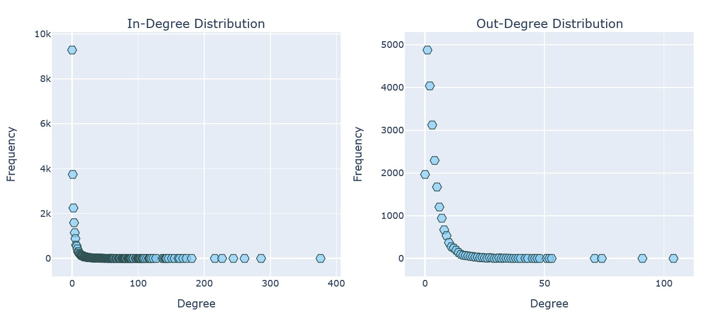
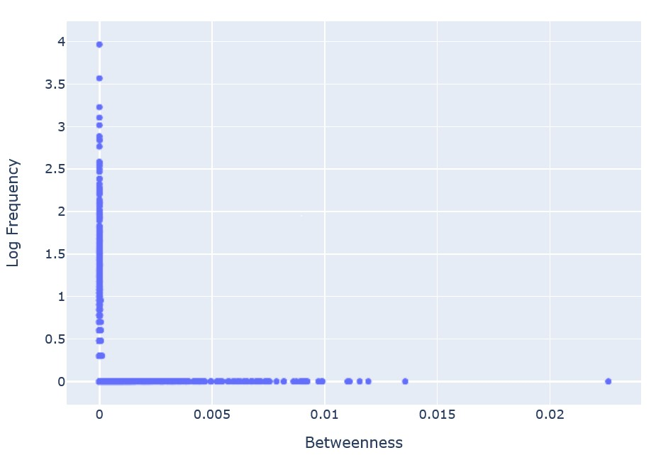
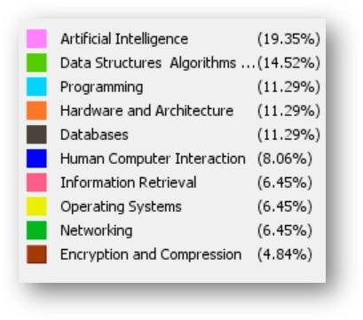
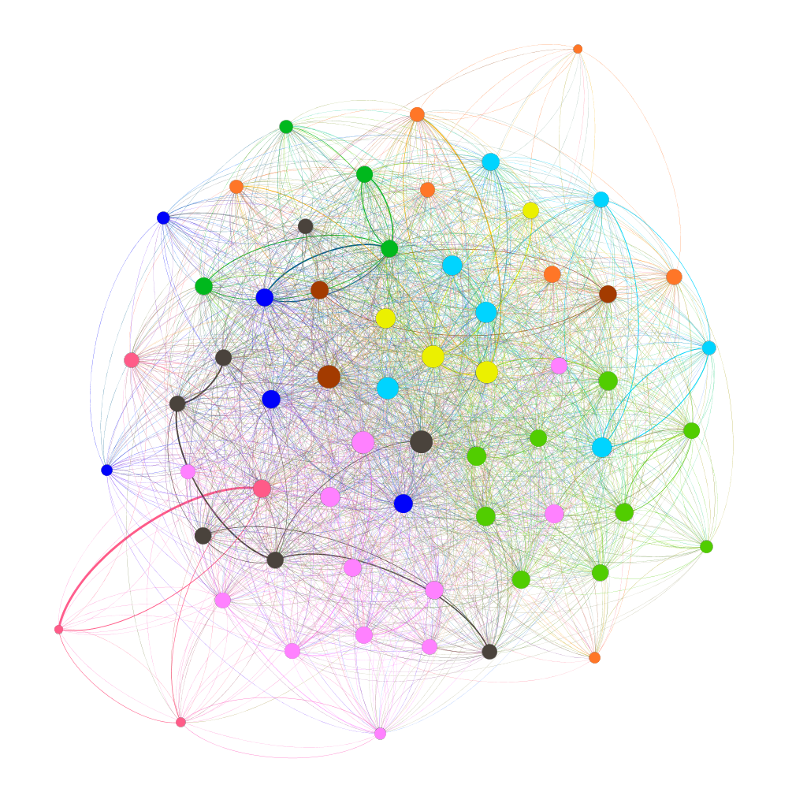
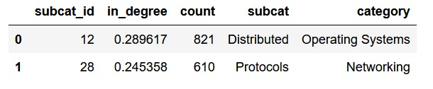

# Cora Citations 

Final project by me and [Shiraz](https://github.com/ShirazFero) for __Social Network Analysis__ course.

## Introduction
### 1.1. The Data

We chose the Cora Citation Network, it is a directed network where nodes represent scientific papers, an edge between two nodes indicates that the left node cites the right node, the edges are unweighted. In addition, the papers are classified into categories and sub-categories.

### 1.2. Research Question

What is the most cited sub-category that all other categories depend on?

Most central sub-category - one that most of its papers are cited in papers from a different sub-category.

### 1.3. Approach for our research

To answer the research question we're going to build a new graph where each node is a collection of articles from the same sub-category. This new graph will be directed and weighted where the weight is calculated by % of papers that have an out-degree >= 1 times % of papers that have in degree.

## 2. Building the Network
### 2.1. Data Cleansing
Here we removed extra columns we didn't need and the final data we built consists of two tables (data frames):
1. The network

cites |    cited
------------ | -------------
20128 |    6078
22236 |    10436

2. Description

network_id |   category | sub_cat
------------ | ------------- | -------------
1 |    Databases |    Performance
2 |    Human Computer Interaction |   Cooperative

### 2.2. Create the Network

Using the first table, create a directed graph using networkx library, Some of the network's properties:
- Type: DiGraph
- Number of nodes: 23166
- Number of edges: 91500
- Average in degree:   3.9498
- Average out-degree:   3.9498
- Is the Graph directed? True
- Graph Density is: 0.00017050524281260305
- Average Clustering: 0.14601503382808564

## 3. Distributions
### 3.1. Degree Distribution

Since our network is directed we'll calculate both in and out-degree for each node, we expect to get power-law distribution in both.

__Conclutions__

As expected both the in and out-degree distributions are the power-law distribution which means small occurrences are extremely common, notice that in the number of in-degree of 0 is much higher than in out-degree which makes sense since most articles cite at least another article but there is a big number of articles that no one cited so far.

### 3.2. Betweenness Distribution 

__Conclutions__
The edge with the highest betweenness is from _Sub category: Compression (Encryption and Compression)_ to 
_Sub category: Memory Management (Operating Systems)_.

An edge with a high edge betweenness centrality score represents a bridge-like connector between two parts of a network and the removal of which may affect the communication between many pairs of nodes through the shortest paths between them.

## 4. Our Analysis

We're aiming to find the sub-category that is cited the most, as we said before we'll build a new graph where:
- Nodes: Sub-categories.
- Edges: citations between sub-categories.
- Edge Weight: Strength in which one sub-category depends on the other.

### 4.1. Building the New Graph
After some data manipulation, we have all sub-categories, each with an id, its category, and count which indicates the number of articles in it. Those are the _nodes_, the edges are the citations from one sub-cat to another,  but in order to include the fact that we have more than one citation from one sub-category to another and also maintain the fact that some sub-categories contain more articles than others we did the following calculations: 

_Calculate weight on edges_ - 
For each edge we'll calculate two percent, given sub-category A citing sub-category B first we'll calculate the percent of articles from A cite articles from B, then we'll calculate the percent of cited articles in B (by A). the product of these two percents is the edge's weight, it indicates how much A is based on B.

_Build the new netowrk_ Basic information about the new network:
Type: DiGraph
Number of nodes: 62
Number of edges: 2140
Average in degree:  34.5161
Average out-degree:  34.5161
Is the Graph directed? True
Graph Density is: 0.5658381808566896
Average Clustering: 0.697772949549231

And it looks like this: 

### 4.2. Finding Most Central Sub-Category

Calculate the in degree for each node (sub-category) which is the sum of all weights on in-edges.

__Most Central Sub-Category - Distributed from Operating Systems__

## 5. Additional Analysis
### 5.1. Again, Central Sub-Category 
We've calculated the central sub-category in the whole world (all 62 sub-categories), now we want to check if that sub-category is also the most central sub-category in it's category. Meaning if we run the same analysis we did before but this time only on the sub-categories from Operating Systems will we get the same answer?

__Conclutions__
As we expected, the most central sub-category between the Operating Systems sub-categories is the same sub-category that is most central is the whole network which is Distributed

### 5.2. Strongest Edge
Check which sub-category relies most on another sub-category, meaning it has the highest weight on the edge.

__Conclutions__
The edge with highest weight is Filtering IR to Retrieval IR, which means the first one relies on the second the most related to all other edges.
